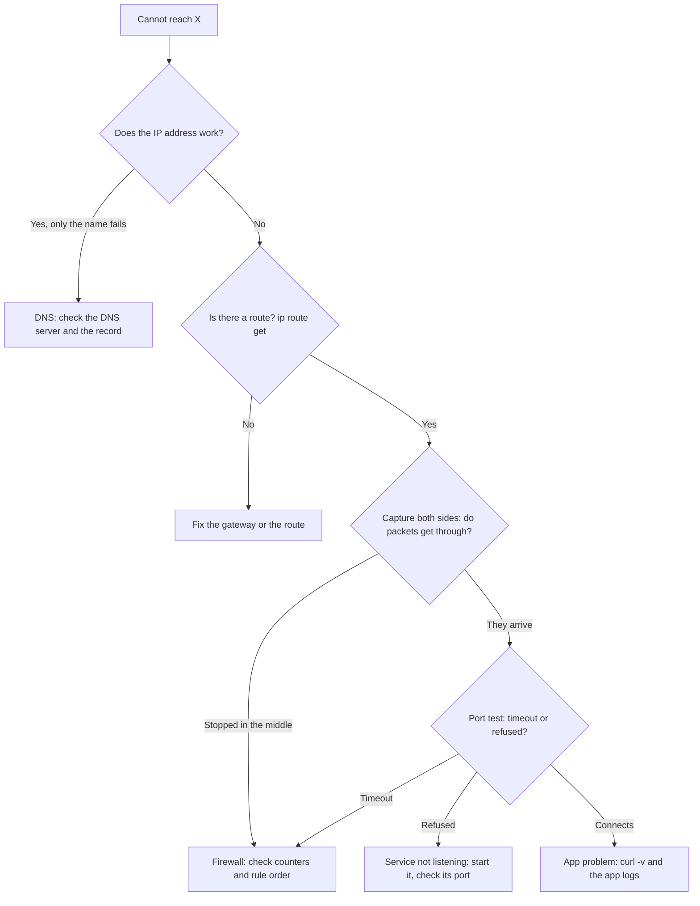

# How I troubleshoot "I can't reach it"

```mermaid
flowchart TD
  A[Cannot reach X] --> B{Does the IP address work?}
  B -- Yes, only the name fails --> N[DNS: check the DNS server and the record]
  B -- No --> R{Is there a route? ip route get}
  R -- No --> R1[Fix the gateway or the route]
  R -- Yes --> C{Capture both sides: do packets get through?}
  C -- Stopped in the middle --> F[Firewall: check counters and rule order]
  C -- They arrive --> P{Port test: timeout or refused?}
  P -- Timeout --> F
  P -- Refused --> S[Service not listening: start it, check its port]
  P -- Connects --> APP[App problem: curl -v and the app logs]
```
